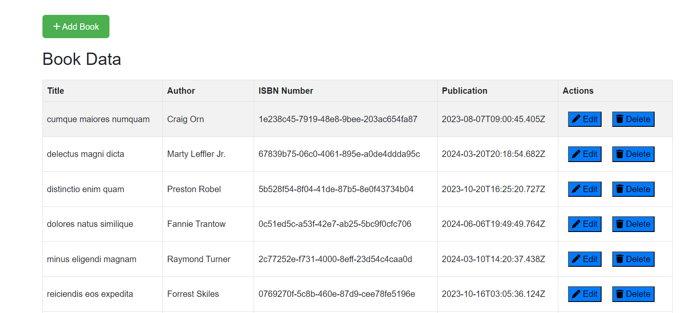
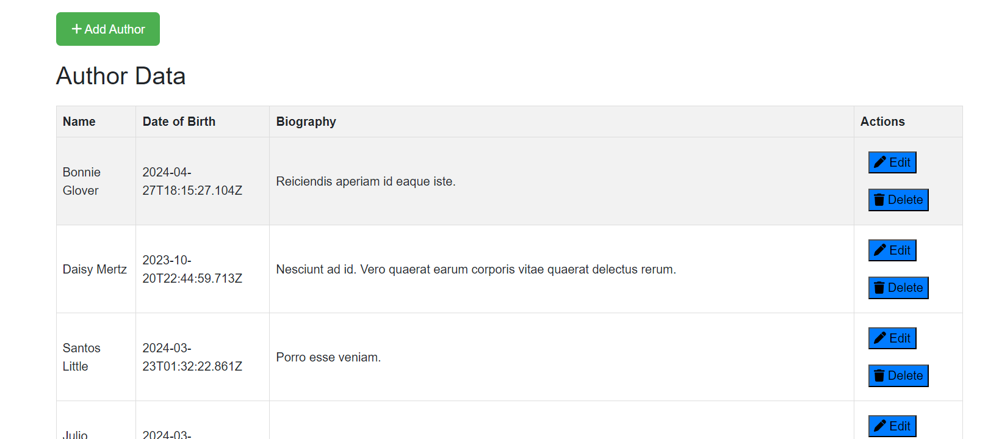

## React Formik Validation Task

**Task Description**

  - Create an admin dashboard for a library management system that allows users to manage book and author details. Use Formik for all form validations

**Requirements**

  - Users should be able to add, edit, and delete book records. Each book record should contain the title, author, ISBN number, and publication date.
  - Users should be able to add, edit, and delete author records. Each author record should contain the author's name, birth date, and a short biography.
  - All forms used in the dashboard should be validated using Formik.
  - The dashboard should have a clean and responsive design that is easy to use and navigate.


**Deliverables:**
 
  - A working React application that meets the above requirements.
  - The application should be well-documented, including code comments and a README file that describes how to run the application.
  - The code should be submitted in a Git repository, with a clear commit history that demonstrates the development process.

 
 **Description**
   
   * In [Index.html](./index.html)
      
      - Bootstrap is used for building responsive, mobile-first websites with pre-designed CSS and JavaScript components.
      - `div` is used for building responsive web pages with pre-designed components and utilities.
   
   * In [App.jsx](./src/App.jsx)
      
      - **Routing Setup with `react-router-dom`**:
           - The code sets up routing using `react-router-dom` with `RouterProvider` and `createBrowserRouter`.
           - `createBrowserRouter` is used to define routes and their corresponding components.

      - **Components and Structure**:
           - **Dashboard**: Rendered at the root (`/`) path, displaying two cards linked to `/bookdata` and `/authorsdata`.
           - **BookData**: Component rendered when navigating to `/bookdata`. It presumably loads book data using `BooksLoader`.
           - **AuthorsData**: Component rendered when navigating to `/authorsdata`.

      - **Styling and UI**:
           - The UI uses CSS classes (`App.css`) for styling, ensuring a visually appealing presentation.
           - Each route link (`<Link>`) is styled as a card (`<div className="card1 card">`, `<div className="card2 card">`) containing images and titles (`Books`, `Authors`).

      - **Routing Structure**:
           - **Root Path (`/`)**: Renders `Dashboard`, which presents links to navigate to specific data views (`/bookdata` and `/authorsdata`).
           - **Nested Routes**: Utilizes nested routes under `/` for detailed views (`/bookdata` and `/authorsdata`).
           - **Dynamic Loading**: Demonstrates dynamic loading (`loader` prop in `createBrowserRouter`), possibly for asynchronous data fetching when navigating to `/bookdata`.


   * In [App.css](./src/App.css)

      - The CSS styles define a responsive navbar, centered content layout, and styled cards for a React application with dynamic routing.
  
   * In [Dashboardjsx](./src/components/Dashboard.jsx)

      -  The `Dashboard` component renders a navigation bar with a highlighted "Dashboard" link and dynamically renders child components using `<Outlet />` from `react-router-dom`.
   
   * In [BookData.jsx](/src/components/BookData.jsx)

      - **Data Fetching**: Utilizes `axios` to fetch book data from a mock API (`https://66742b3a75872d0e0a95614b.mockapi.io/book`) using the `loader` function.

      - **State Management**: Uses `useState` to manage state:
           - `books`: Stores fetched book data.
           - `showInputRow`: Controls visibility of the input form for adding or editing books.
           - `editingBookId`: Tracks the ID of the book being edited.

      - **Form Handling**: Employs `useFormik` for form management:
           - Handles form validation for fields (`title`, `author`, `isbn`, `publicationdate`).
           - Submits form data to either add or update a book.
           - Resets form and updates state after successful actions (`Add`, `Update`).

      - **Event Handlers**:
           - `handleAddButtonClick`: Sets up for adding a new book.
           - `handleEditButtonClick`: Prepares the form for editing an existing book.
           - `handleDelete`: Deletes a book based on its ID.

      - **User Interface**:
           - Displays a button (`Add Book`) to toggle the visibility of the input form.
           - Renders a table (`bookTable`) listing book details (title, author, ISBN, publication date) fetched from the API.
           - Provides `Edit` and `Delete` buttons within each table row to modify or remove books.

      - **Styling**: Applies CSS classes (`Book.css`) for consistent UI presentation:
           - Styles form inputs, buttons, and table rows for clarity and user interaction.

      - **Error Handling**: Alerts users of errors during API interactions (`axios` requests) via browser alerts.

   * In [Book.css](/src/components/Book.css)

      - The CSS styles for `.BookData` set maximum width, center alignment, and padding. `.topButtons` arranges buttons flexibly. `.bookTable` styles a responsive table with alternating row colors. `.inputRow` formats form elements and buttons dynamically, adjusting for smaller screens with media queries.

   * In [AuthorsData.jsx](/src/components/AuthorsData.jsx)

      - **Data Fetching**: Utilizes `axios` to fetch author data from a mock API (`https://66742b3a75872d0e0a95614b.mockapi.io/author`) using the `loader` function.

      - **State Management**: Uses `useState` to manage state:
           - `authors`: Stores fetched author data.
           - `showInputRow`: Controls visibility of the input form for adding or editing authors.
           - `editingAuthorId`: Tracks the ID of the author being edited.

      - **Form Handling**: Employs `useFormik` for form management:
           - Validates form fields (`name`, `birthdate`, `biography`).
           - Submits form data to either add or update an author.
           - Resets form and updates state after successful actions (`Add`, `Update`).

      - **Event Handlers**:
           - `handleAddButtonClick`: Sets up for adding a new author.
           - `handleEditButtonClick`: Prepares the form for editing an existing author.
           - `handleDelete`: Deletes an author based on their ID.

      - **User Interface**:
           - Displays a button (`Add Author`) to toggle the visibility of the input form.
           - Renders a table (`authorTable`) listing author details (name, birthdate, biography) fetched from the API.
           - Provides `Edit` and `Delete` buttons within each table row for modifying or removing authors.

      - **Styling**: Applies CSS classes (`Author.css`) for consistent UI presentation:
           - Styles form inputs, buttons, and table rows for clarity and user interaction.

      - **Error Handling**: Alerts users of errors during API interactions (`axios` requests) via browser alerts.

    
   * In [Author.css](/src/components/Author.css)

      - The CSS styles for `.AuthorsData` set maximum width, center alignment, and padding. `.topButtons` arranges buttons flexibly. `.authorTable` styles a responsive table with alternating row colors. `.inputRow` formats form elements and buttons for author data entry, adjusting for smaller screens with media queries.

**To run the provided React code effectively, follow these steps:**

   1. **Setup React Environment**:
      - Ensure you have Node.js installed on your machine. You can download it from [nodejs.org](https://nodejs.org/).

   2. **Create React App** (if not already created):
       - If you haven't set up a React project yet, you can create one using Create React App by running:
        
            ```bash
            npx create-react-app my-react-app
            ```
        Replace `my-react-app` with your desired project name.

   3. **Navigate to Project Directory**:
        - Change directory to your project folder:
        
            ```bash
            cd my-react-app
            ```

   4. **Install Dependencies**:
        - Install required dependencies (`axios`, `formik`, `@fortawesome/react-fontawesome`, `@fortawesome/free-solid-svg-icons`, `react-router-dom`) using npm or yarn:
            ```bash
            npm install axios formik @fortawesome/react-fontawesome @fortawesome/free-solid-svg-icons react-router-dom
            ```
    

   5. **Replace Existing Files**:
        - Replace the contents of `src/components/Author.css`, `src/components/AuthorsData.js`, and `src/components/Book.css`, `src/components/BookData.js` with the provided CSS and React components respectively.

   6. **Start the Development Server**:
        - Start the development server to run your React application:
            ```bash
            npm start
            ```
   
   7. **View Your Application**:
        - Once the server has started, your React application will open automatically in your default web browser at `http://localhost:5173/`.
        - You should now be able to interact with the application, add/edit/delete books or authors, and see the changes reflected in the UI.

**Output:** 

     

**For future enhancement:**
         

      Implement user authentication to secure data operations, integrate search and filtering functionalities for books and authors, add pagination for large datasets, enable sorting options, and create data visualization features like charts to analyze book and author trends.